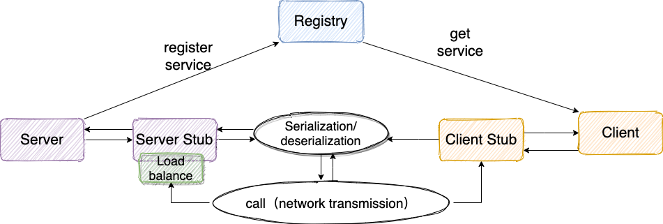

# rpc-framework

## 介绍

[rpc-framework](https://github.com/GXhunter/rpc-framework) 是一款基于 Netty+Kyro+Zookeeper 实现的 RPC 框架。代码注释详细，结构清晰，非常适合阅读和学习。

由于笔者自身精力和能力有限，如果大家觉得有需要改进和完善的地方的话，欢迎 fork 本项目，然后 clone 到本地，在本地修改后提交 PR 给我，我会在第一时间 Review 你的代码。

**我们先从一个基本的 RPC 框架设计思路说起！**

### 一个基本的 RPC 框架设计思路

> **注意** ：我们这里说的 RPC 框架指的是：可以让客户端直接调用服务端方法就像调用本地方法一样简单的框架，比如我前面介绍的 Dubbo、Motan、gRPC 这些。 如果需要和 HTTP 协议打交道，解析和封装 HTTP 请求和响应。这类框架并不能算是“RPC 框架”，比如 Feign。

一个最简单的 RPC 框架使用示意图如下图所示,这也是 [rpc-framework](https://github.com/GXhunter/rpc-framework) 目前的架构 ：


服务提供端 Server 向注册中心注册服务，服务消费者 Client 通过注册中心拿到服务相关信息，然后再通过网络请求服务提供端 Server。

作为 RPC 框架领域的佼佼者[Dubbo](https://github.com/apache/dubbo)的架构如下图所示,和我们上面画的大体也是差不多的。


**一般情况下， RPC 框架不仅要提供服务发现功能，还要提供负载均衡、容错等功能，这样的 RPC 框架才算真正合格的。**

**简单说一下设计一个最基本的 RPC 框架的思路：**



1. **注册中心** ：注册中心首先是要有的，推荐使用 Zookeeper。注册中心负责服务地址的注册与查找，相当于目录服务。服务端启动的时候将服务名称及其对应的地址(ip+port)注册到注册中心，服务消费端根据服务名称找到对应的服务地址。有了服务地址之后，服务消费端就可以通过网络请求服务端了。
2. **网络传输** ：既然要调用远程的方法就要发请求，请求中至少要包含你调用的类名、方法名以及相关参数吧！推荐基于 NIO 的 Netty 框架。
3. **序列化** ：既然涉及到网络传输就一定涉及到序列化，你不可能直接使用 JDK 自带的序列化吧！JDK 自带的序列化效率低并且有安全漏洞。 所以，你还要考虑使用哪种序列化协议，比较常用的有 hession2、kyro、protostuff。
4. **动态代理** ： 另外，动态代理也是需要的。因为 RPC 的主要目的就是让我们调用远程方法像调用本地方法一样简单，使用动态代理可以屏蔽远程方法调用的细节比如网络传输。也就是说当你调用远程方法的时候，实际会通过代理对象来传输网络请求，不然的话，怎么可能直接就调用到远程方法呢？
5. **负载均衡** ：负载均衡也是需要的。为啥？举个例子我们的系统中的某个服务的访问量特别大，我们将这个服务部署在了多台服务器上，当客户端发起请求的时候，多台服务器都可以处理这个请求。那么，如何正确选择处理该请求的服务器就很关键。假如，你就要一台服务器来处理该服务的请求，那该服务部署在多台服务器的意义就不复存在了。负载均衡就是为了避免单个服务器响应同一请求，容易造成服务器宕机、崩溃等问题，我们从负载均衡的这四个字就能明显感受到它的意义。
6. ......

### 项目基本情况

- [x] **使用 Netty（基于 NIO）替代 BIO 实现网络传输；**
- [x] **使用开源的序列化机制 Kyro（也可以用其它的）替代 JDK 自带的序列化机制；**
- [x] **使用 Zookeeper 管理相关服务地址信息**
- [x] Netty 重用 Channel 避免重复连接服务端
- [x] 使用 `CompletableFuture` 包装接受客户端返回结果（之前的实现是通过 `AttributeMap` 绑定到 Channel 上实现的）
- [x] **增加 Netty 心跳机制** : 保证客户端和服务端的连接不被断掉，避免重连。
- [x] **客户端调用远程服务的时候进行负载均衡** ：调用服务的时候，从很多服务地址中根据相应的负载均衡算法选取一个服务地址。ps：目前实现了随机负载均衡算法与一致性哈希算法。
- [x] **处理一个接口有多个类实现的情况** ：对服务分组，发布服务的时候增加一个 group 参数即可。
- [x] **集成 Spring 通过注解注册服务**
- [x] **集成 Spring 通过注解进行服务消费** 。参考： [PR#10](https://github.com/GXhunter/rpc-framework/pull/10)
- [x] **增加服务版本号** ：建议使用两位数字版本，如：1.0，通常在接口不兼容时版本号才需要升级。为什么要增加服务版本号？为后续不兼容升级提供可能，比如服务接口增加方法，或服务模型增加字段，可向后兼容，删除方法或删除字段，将不兼容，枚举类型新增字段也不兼容，需通过变更版本号升级。
- [x] **对 SPI 机制的运用**
- [x] **客户端与服务端通信协议（数据包结构）重新设计** ，可以将原有的 `RpcRequest`和 `RpcReuqest` 对象作为消息体，然后增加如下字段（可以参考：《Netty 入门实战小册》和 Dubbo 框架对这块的设计）：
    - **魔数** ： 通常是 4 个字节。这个魔数主要是为了筛选来到服务端的数据包，有了这个魔数之后，服务端首先取出前面四个字节进行比对，能够在第一时间识别出这个数据包并非是遵循自定义协议的，也就是无效数据包，为了安全考虑可以直接关闭连接以节省资源。
    - **序列化器编号** ：标识序列化的方式，比如是使用 Java 自带的序列化，还是 json，kyro 等序列化方式。
    - **消息体长度** ： 运行时计算出来。
    - ......
- [x] **设置 gzip 压缩**


## 运行项目

### 导入项目

1. 在空白目录执行：`git clone git@github.com:GXhunter/rpc-framework.git`
2. 在clone后的根目录执行：`mvn clean instgall`

### 运行 zookeeper

这里使用 Docker 来下载安装。

下载：

```shell
docker pull zookeeper:3.5.8
```

运行：

```shell
docker run -d --name zookeeper -p 2181:2181 zookeeper:3.5.8
```

## 使用方法

>不论服务/消费端都需要进行下属两个步骤

### 1. maven依赖

```xml
    <dependency>
    	<groupId>com.github.gxhunter</groupId>
    	<artifactId>rpc-framework-core</artifactId>
    	<version>${rpc-version}</version>
    </dependency>
```

### 2. 注册中心配置

在 `resources`目录下新建`rpc.properties`文件，内容为:`rpc.zookeeper.address=${zookeeperAddress}`,例如`rpc.zookeeper.address=localhost:2181`

# 代码示例

示例代码分为API、server、client三个模块

## API

1. pom

   ```xml
   <?xml version="1.0" encoding="UTF-8"?>
   <project xmlns="http://maven.apache.org/POM/4.0.0"
            xmlns:xsi="http://www.w3.org/2001/XMLSchema-instance"
            xsi:schemaLocation="http://maven.apache.org/POM/4.0.0 http://maven.apache.org/xsd/maven-4.0.0.xsd">
       <modelVersion>4.0.0</modelVersion>
   
       <groupId>org.example</groupId>
       <artifactId>rpc-api</artifactId>
       <version>1.0-SNAPSHOT</version>
   
       <properties>
           <maven.compiler.source>8</maven.compiler.source>
           <maven.compiler.target>8</maven.compiler.target>
           <project.build.sourceEncoding>UTF-8</project.build.sourceEncoding>
       </properties>
   
       <dependencies>
           <dependency>
               <groupId>com.github.gxhunter</groupId>
               <artifactId>rpc-framework-common</artifactId>
               <version>1.0</version>
           </dependency>
   
       </dependencies>
   
   
   </project>
   ```

2. 接口

   ```java
   import com.github.gxhunter.rpc.common.annotation.RpcClient;
   
   @RpcClient("RServer")
   public interface TestServer {
       String getVersion();
   }
   ```

   

### 服务端

1. 服务端maven的pom文件

    ```xml
    <?xml version="1.0" encoding="UTF-8"?>
    <project xmlns="http://maven.apache.org/POM/4.0.0" xmlns:xsi="http://www.w3.org/2001/XMLSchema-instance"
        xsi:schemaLocation="http://maven.apache.org/POM/4.0.0 https://maven.apache.org/xsd/maven-4.0.0.xsd">
        <modelVersion>4.0.0</modelVersion>
        <parent>
            <groupId>org.springframework.boot</groupId>
            <artifactId>spring-boot-starter-parent</artifactId>
            <version>2.7.15</version>
            <relativePath/> <!-- lookup parent from repository -->
        </parent>
        <groupId>com.rpc.server</groupId>
        <artifactId>rpc-server</artifactId>
        <version>0.0.1-SNAPSHOT</version>
        <name>rpc-server</name>
        <description>rpc-server</description>
        <properties>
            <java.version>8</java.version>
        </properties>
        <dependencies>
            <dependency>
                <groupId>org.springframework.boot</groupId>
                <artifactId>spring-boot-starter</artifactId>
            </dependency>
            
            <!-- rpc-api 此包只写接口，服务端/客户端都需要依赖此包，用于规范服务端接接口实现，同时用于客户端生成动态代理-->
            <dependency>
                <groupId>org.example</groupId>
                <artifactId>rpc-api</artifactId>
                <version>1.0-SNAPSHOT</version>
            </dependency>
            <dependency>
                <groupId>com.github.gxhunter</groupId>
                <artifactId>rpc-framework-core</artifactId>
                <version>1.0</version>
            </dependency>
    
    
            <dependency>
                <groupId>org.springframework.boot</groupId>
                <artifactId>spring-boot-starter-test</artifactId>
                <scope>test</scope>
            </dependency>
        </dependencies>
    
        <build>
            <plugins>
                <plugin>
                    <groupId>org.springframework.boot</groupId>
                    <artifactId>spring-boot-maven-plugin</artifactId>
                </plugin>
            </plugins>
        </build>
    
    </project>
    
    ```

2. 服务端对接口具体实现

    ```java
    @RpcService
    public class TestServerImpl implements TestServer {
        @Override
        public String getVersion() {
            return "23.0";
        }
    }
    ```

    

3. 启动主类

    ```java
    
    import com.github.gxhunter.rpc.core.annotation.EnableRpcServices;
    import com.github.gxhunter.rpc.core.server.IRpcServer;
    import com.github.gxhunter.rpc.core.server.NettyRpcServer;
    import org.springframework.boot.SpringApplication;
    import org.springframework.boot.autoconfigure.SpringBootApplication;
    import org.springframework.context.annotation.Bean;
    
    @SpringBootApplication
    //指定服务名
    @EnableRpcServices(serverName = "RServer")
    public class RpcServerApplication {
    	@Bean
    	public IRpcServer rpcServer() {
    		return new NettyRpcServer();
    	}
    	public static void main(String[] args) {
    		SpringApplication.run(RpcServerApplication.class, args).getBean(IRpcServer.class).start();
    	}
    
    }
    
    ```

    

### 消费端

1. pom

   ```xml
   <?xml version="1.0" encoding="UTF-8"?>
   <project xmlns="http://maven.apache.org/POM/4.0.0" xmlns:xsi="http://www.w3.org/2001/XMLSchema-instance"
            xsi:schemaLocation="http://maven.apache.org/POM/4.0.0 https://maven.apache.org/xsd/maven-4.0.0.xsd">
       <modelVersion>4.0.0</modelVersion>
       <parent>
           <groupId>org.springframework.boot</groupId>
           <artifactId>spring-boot-starter-parent</artifactId>
           <version>2.7.15</version>
           <relativePath/> <!-- lookup parent from repository -->
       </parent>
       <groupId>com.example</groupId>
       <artifactId>rpc-client</artifactId>
       <version>0.0.1-SNAPSHOT</version>
       <name>rpc-client</name>
       <description>rpc-client</description>
       <properties>
           <java.version>8</java.version>
       </properties>
       <dependencies>
           <dependency>
               <groupId>org.springframework.boot</groupId>
               <artifactId>spring-boot-starter</artifactId>
           </dependency>
           <dependency>
               <groupId>org.example</groupId>
               <artifactId>rpc-api</artifactId>
               <version>1.0-SNAPSHOT</version>
           </dependency>
           <dependency>
               <groupId>com.github.gxhunter</groupId>
               <artifactId>rpc-framework-core</artifactId>
               <version>1.0</version>
           </dependency>
   
   
           <dependency>
               <groupId>org.projectlombok</groupId>
               <artifactId>lombok</artifactId>
               <optional>true</optional>
           </dependency>
       </dependencies>
   
       <build>
           <plugins>
               <plugin>
                   <groupId>org.springframework.boot</groupId>
                   <artifactId>spring-boot-maven-plugin</artifactId>
                   <configuration>
                       <excludes>
                           <exclude>
                               <groupId>org.projectlombok</groupId>
                               <artifactId>lombok</artifactId>
                           </exclude>
                       </excludes>
                   </configuration>
               </plugin>
           </plugins>
       </build>
   
   </project>
   
   ```

2. 入口类

   ```java
   @SpringBootApplication
   //配置api接口所在的位置
   @EnableRpcClients(basePackages = "com.rpc.learn.api")
   public class RpcClientApplication {
   
       public static void main(String[] args) {
           ConfigurableApplicationContext context = SpringApplication.run(RpcClientApplication.class, args);
           System.out.println(context.getBean(TestServer.class).getVersion());
       }
   
   }
   ```

   


